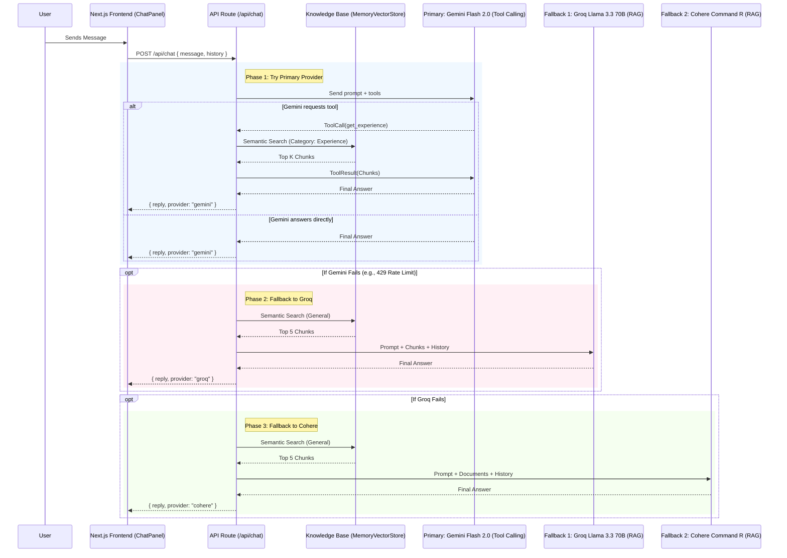

# Proxy Interview Chatbot — Comprehensive Architecture & Implementation Plan

This document serves as the complete technical blueprint for building the Proxy Interview Chatbot for Siddhesh Parab's Next.js portfolio.

## 1. Architectural Overview

The system is a sophisticated Retrieval-Augmented Generation (RAG) agent that employs a tool-calling primary model and graceful fallback models to ensure high availability and accuracy.

### 1.1 Architecture Diagram

### 1.2 System Components Detailed Explanation

#### A. The Knowledge Base (In-Memory Vector Store)
Instead of hitting external databases on every request, we build an in-memory RAG system natively within the Next.js backend.
- **Data Source:** Static data from `src/lib/data.ts` (experience, projects, skills). This prevents Notion API rate limiting.
- **Transformation:** Raw JSON arrays are mapped into natural language paragraphs (e.g., `"Siddhesh worked at Align Technology from 2023 to 2025 as a Sr. SQA Engineer, deploying LLM-based log parsing..."`). This is crucial because embedding models extract meaning much more effectively from cohesive natural language than from raw JSON key-value pairs.
- **Embedding:** We use Google's `text-embedding-004` via `@langchain/google-genai` to generate semantic vectors for each paragraph chunk.
- **Storage & Retrieval:** The chunks and their corresponding vectors are stored in LangChain's `MemoryVectorStore`. We use metadata filtering (e.g., `category: "experience"`) to narrow down vector searches when a specific tool is called by the LLM.
- **Singleton Pattern:** To prevent Next.js from rebuilding the vector store on every hot reload during development or on every serverless invocation, we declare a `globalThis` variable that caches the instance.

#### B. The LLM Waterfall Strategy
The architecture guarantees high availability by chaining three distinct LLM providers:
1. **Gemini Flash 2.0 (Primary):** Equipped with Tool Calling capabilities. Gemini evaluates the user's message, dynamically decides if it needs to look up projects, experience, or bio, executes the specific tool, and synthesizes the exact answer.
2. **Groq Llama 3.3 70B (Fallback 1):** If the Gemini API hits a rate limit or throws an error, the `catch` block instantly triggers Groq. Since Groq does not use tool calling in this implementation, the API route preemptively performs a general semantic search across the vector store for the top 5 chunks matching the user's query, and injects them directly into Groq's system prompt (Standard RAG).
3. **Cohere Command R (Fallback 2):** If the Groq API also fails, Cohere is triggered using the same pre-retrieved 5 chunks, passed via Cohere's native `documents` parameter in its chat API.

#### C. The Frontend Integration
- **State Management:** React `useState` tracks the conversation history, loading states, and current user input natively on the client.
- **UI Architecture:** 
  - `ChatBubble`: A persistent Floating Action Button (FAB) anchored to the bottom right of the viewport.
  - `ChatPanel`: An absolute-positioned, slide-up overlay containing the chat log. It includes UX features like auto-scroll to bottom, typing indicators (animated dots), and dynamic metadata pills (e.g., displaying "Looked up: experience" or showing an "Answered by Gemini" provider badge).

---

## 2. Implementation Execution Plan

### Step 1: Foundation & Dependencies
- Execute `npm install` for all required AI SDKs to enable Langchain, Google Generative AI, Groq, and Cohere.
- Expose the necessary `API_KEY` placeholders in the local environment.

### Step 2: Constructing the Knowledge Engine (`src/lib/chatKnowledge.ts`)
- **Code Structure:**
  - Import `GoogleGenerativeAIEmbeddings` and `MemoryVectorStore`.
  - Write the `buildKnowledgeBase()` function: This function iterates over the exports from `src/lib/data.ts`, compiles them into a flattened array of LangChain `Document` objects with metadata `{ category, title }`, and passes them into the embedder.
  - Implement caching: `if (!globalThis.vectorStore) globalThis.vectorStore = await buildKnowledgeBase();`.
- **Tool Functions:** Export distinct asynchronous functions (`searchExperience()`, `searchProjects()`, `getBio()`, etc.) that execute `vectorStore.similaritySearch(query, k, filter)` tailored to their specific domains.

### Step 3: API Route Engineering (`src/app/api/chat/route.ts`)
- **Setup:** Define Next.js App Router conventions, specifically setting `export const runtime = 'nodejs'` to bypass Edge runtime limitations common with complex LangChain dependencies.
- **Prompt Engineering:** Formulate the stringent system prompt enforcing the first-person perspective ("I am Siddhesh"), restricting hallucinations, and rejecting off-topic questions gracefully.
- **Tool Definitions:** Map the `chatKnowledge.ts` functions to OpenAPI-style JSON schemas required by the Gemini SDK's `tools` array.
- **Control Flow:**
  - A main `try` block for Gemini. It initializes the `chatSession`, sends the message, checks the response for `functionCalls`, executes the respective internal function from `chatKnowledge.ts`, returns the `functionResponse`, and retrieves the final synthesized text.
  - A `catch` block that triggers the Groq fallback sequence. It utilizes `searchKnowledgeBase(userMessage)` to get raw context strings, appends them to the system prompt, and requests a completion.
  - A nested `catch` block handling the Cohere fallback similarly.

### Step 4: Frontend Development
- **`ChatPanel.tsx`:** 
  - Construct the UI utilizing Tailwind utility classes and the project's existing CSS variables (`var(--navy)`, `var(--cream)`, `var(--lime)`).
  - Write the `onSubmit` handler: update local message history, execute a `fetch('/api/chat')` request, and parse the JSON response.
  - Render message bubbles conditionally based on `role`. When `role === 'assistant'`, render the provider badge and `toolsUsed` array as visual pills.
- **`ChatBubble.tsx`:** 
  - Create the circular trigger button with a fixed position. Manage the boolean `isOpen` state and conditionally render `<ChatPanel>`.
- **Global Injection:** Import and mount `<ChatBubble />` inside the root layout (`src/app/layout.tsx`).

---

## 3. Detailed Sub-Task Breakdown

- [ ] **Task 1: Environment & Package Setup**
  - Install packages: `@google/generative-ai`, `groq-sdk`, `cohere-ai`, `@langchain/google-genai`, `@langchain/community`, `langchain`.
  - Add API key variables to `.env.local`.

- [ ] **Task 2: Knowledge Base Architecture** (`src/lib/chatKnowledge.ts`)
  - Create parsing logic to convert `data.ts` objects (Bio, Experience, Projects, Skills, Certifications, Achievements) into structured natural language paragraphs.
  - Implement `getInitializedVectorStore()` using the `globalThis` caching pattern.
  - Implement and export the 7 required semantic search/retrieval functions: `search_experience`, `search_projects`, `search_skills`, `get_certifications`, `get_bio`, `get_achievements`, and `search_knowledge_base`.

- [ ] **Task 3: API Orchestration & Logic** (`src/app/api/chat/route.ts`)
  - Write the authoritative `System Prompt`.
  - Instantiate the Gemini `ChatSession` with the generated tool schemas.
  - Implement the multi-step tool execution loop for Gemini (handling `functionCall` arrays recursively if necessary).
  - Implement `fallbackToGroq(query, history)` using `groq.chat.completions.create` and RAG context injection.
  - Implement `fallbackToCohere(query, history)` using `cohere.chat` and document injection.
  - Combine all steps in a Try-Catch-Catch execution pipeline, returning `{ reply, provider, toolsUsed }`.

- [ ] **Task 4: User Interface Construction**
  - Build `src/components/ChatPanel.tsx` with full state management, loading indicators, and stylized chat bubbles.
  - Build `src/components/ChatBubble.tsx` to handle the absolute positioning and overlay toggling.
  - Build `src/app/chat/page.tsx` as a standalone full-screen route for the chat interface.

- [ ] **Task 5: Application Integration**
  - Append the `<ChatBubble />` component immediately before the closing `</body>` tag in `src/app/layout.tsx`.
  - Update `src/components/Navbar.tsx` to add a new "Chat" navigation link pointing to the `/chat` route.
